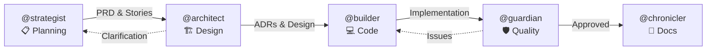

# DevFlow v0.3.0 - Sistema Multi-Agentes para Desenvolvimento

Sistema simplificado de multi-agentes especializados para desenvolvimento de software, otimizado para uso com Claude Code.

[](docs/CHANGELOG.md)
[](LICENSE)

## 🆕 Novidades v0.3.0

- **Hard Stops**: Cada agente tem regras rígidas que impedem violações de papel
- **Delegação Obrigatória**: Fluxo mandatório entre agentes
- **Geração Automática de Stories**: @chronicler gera stories se @strategist não criar
- **AI Optimization Guide**: Guia completo para maximizar capacidades

---

## 🚀 Instalação em 3 Passos

### 1. Clone este repositório
```bash
git clone https://github.com/evolve-labs-cloud/dexter-devflow.git
cd dexter-devflow
```

### 2. Instale no seu projeto
```bash
# Opção A: Script automático (recomendado)
./install.sh /caminho/para/seu-projeto

# Opção B: Manual
cp -r .devflow /caminho/para/seu-projeto/
cp -r docs /caminho/para/seu-projeto/
```

### 3. Comece a usar
```bash
cd /caminho/para/seu-projeto
# No Claude Code:
@strategist Olá! Quero criar [sua feature]
```

**Pronto! Zero configuração necessária.**

---

## 🤖 Os 5 Agentes

| Agente | Função | Uso |
|--------|--------|-----|
| **@strategist** | Planejamento & Produto | Requisitos, PRDs, user stories |
| **@architect** | Design & Arquitetura | Decisões técnicas, ADRs, APIs |
| **@builder** | Implementação | Código, reviews, refactoring |
| **@guardian** | Qualidade & Segurança | Testes, security, performance |
| **@chronicler** | Documentação & Memória | CHANGELOG, snapshots, stories |

### 🚨 Hard Stops (v0.3.0)

Cada agente agora tem limites rígidos:

```
@strategist → APENAS planejamento (NUNCA código)
@architect  → APENAS design técnico (NUNCA implementação)
@builder    → APENAS código (NUNCA requisitos)
@guardian   → APENAS QA/segurança (NUNCA features)
@chronicler → APENAS documentação (NUNCA código)
```

### Fluxo Obrigatório



**Fluxo Linear**: `@strategist → @architect → @builder → @guardian → @chronicler`

---

## 📁 Estrutura Instalada

```
seu-projeto/
├── .devflow/
│   ├── agents/           # 5 agentes especializados (+ metadata)
│   ├── snapshots/        # Histórico do projeto
│   ├── project.yaml      # Estado do projeto (para IA)
│   └── knowledge-graph.json
│
├── docs/
│   ├── decisions/        # ADRs
│   ├── planning/stories/ # User stories (auto-geradas)
│   ├── security/         # Security audits
│   └── performance/      # Performance reports
│
└── seu código...
```

---

## 💡 Diferencial: Zero Drift de Contexto

O **@chronicler** mantém automaticamente:
- ✅ CHANGELOG.md atualizado
- ✅ ADRs para decisões importantes
- ✅ Snapshots do projeto (markdown + JSON)
- ✅ **Knowledge Graph** - Conexões entre decisões, features e agentes
- ✅ **Metadata Estruturada** - Parse 100x mais rápido pela IA
- ✅ **User Stories automáticas** - Se @strategist não criar (v0.3.0)

---

## 📚 Documentação

- **[Quick Start](docs/QUICKSTART.md)** - Comece em 5 minutos
- **[Instalação](docs/INSTALLATION.md)** - Guia detalhado
- **[Arquitetura](docs/ARCHITECTURE.md)** - Como funciona
- **[AI Optimization](docs/AI_OPTIMIZATION_GUIDE.md)** - Maximize capabilities
- **[Changelog](docs/CHANGELOG.md)** - Histórico de mudanças

---

## 🔄 Atualizando de Versões Anteriores

Se você já tem o DevFlow instalado e quer atualizar:

```bash
# 1. Clone ou atualize o repositório
git clone https://github.com/evolve-labs-cloud/dexter-devflow.git
cd dexter-devflow

# 2. Execute o script de update apontando para seu projeto
./update.sh /caminho/para/seu-projeto
```

O script vai:
- Fazer backup dos seus agentes atuais
- Atualizar para a nova versão
- Criar novos diretórios necessários
- Preservar seus snapshots e dados

---

## 📊 Features por Versão

| Versão | Features |
|--------|----------|
| v0.1.0 | Multi-agent system, Documentation automation, Snapshots |
| v0.2.0 | Structured metadata (YAML/JSON), Knowledge graph |
| v0.3.0 | Hard stops, Mandatory delegation, Auto story generation |

---

## 📜 Licença

MIT License - veja [LICENSE](LICENSE) para detalhes.

---

**DevFlow v0.3.0** - Desenvolvido por [Evolve Labs](https://github.com/evolve-labs-cloud)
